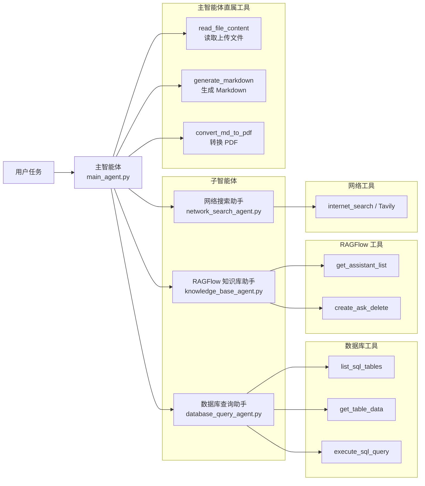
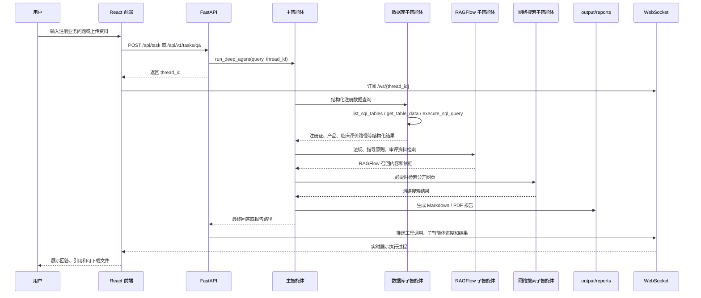
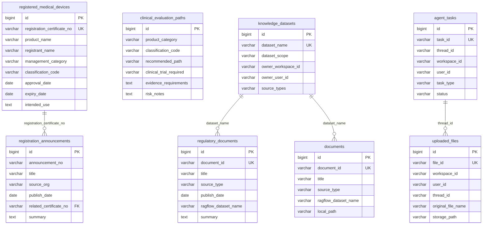

# MediReg Agents 项目架构图

## 1. 总体架构

```mermaid
flowchart TB
    User[用户 / 注册业务人员]

    subgraph Frontend[前端层 React + Vite + Ant Design]
        UI[医疗器械注册问答工作台]
        UploadPanel[文件上传面板]
        ChatPanel[对话与结果展示]
        FileDock[报告与附件下载]
        EventView[工具调用 / 子智能体事件流]
    end

    subgraph API[后端接入层 FastAPI]
        RestAPI[HTTP API\n任务提交 / 文件上传 / 文件列表 / 下载]
        WsAPI[WebSocket\n实时推送执行状态]
        V1API[/api/v1 标准集成接口]
        Monitor[monitor 事件总线]
        TaskStore[任务状态管理\n当前为内存存储]
    end

    subgraph Agent[智能体编排层 DeepAgents]
        MainAgent[主智能体 main_agent\n任务规划 / 工具选择 / 汇总输出]
        DBAgent[数据库查询子智能体]
        KBAgent[RAGFlow 知识库子智能体]
        WebAgent[网络搜索子智能体]
    end

    subgraph Tools[工具层]
        DBTools[MySQL 查询工具\nlist_sql_tables / get_table_data / execute_sql_query]
        RagflowTools[RAGFlow 工具\nget_assistant_list / create_ask_delete]
        TavilyTool[网络搜索工具\nTavily]
        ReadFileTool[上传文件读取工具\nPDF / DOCX / Excel / Markdown / Text]
        MarkdownTool[Markdown 报告生成工具]
        PdfTool[Markdown 转 PDF 工具]
    end

    subgraph Data[数据与文件层]
        MySQL[(MySQL medireg_db\n结构化注册数据)]
        RAGFlow[(RAGFlow datasets\n法规 / 指导原则 / 审评报告 / 共性问题)]
        Uploaded[(app/updated\n上传文件暂存)]
        Output[(app/output/session_xxx\n会话输出目录)]
        Reports[(reports\n运行生成报告 / 阶段分析)]
        Docker[(Docker MySQL\n本地结构化数据库)]
    end

    User --> UI
    UI --> UploadPanel
    UI --> ChatPanel
    UI --> FileDock
    UI --> EventView

    UploadPanel --> RestAPI
    ChatPanel --> RestAPI
    FileDock --> RestAPI
    EventView --> WsAPI

    RestAPI --> TaskStore
    RestAPI --> MainAgent
    WsAPI --> Monitor
    V1API --> TaskStore
    V1API --> MainAgent

    MainAgent --> DBAgent
    MainAgent --> KBAgent
    MainAgent --> WebAgent
    MainAgent --> ReadFileTool
    MainAgent --> MarkdownTool
    MainAgent --> PdfTool

    DBAgent --> DBTools
    KBAgent --> RagflowTools
    WebAgent --> TavilyTool

    DBTools --> MySQL
    RagflowTools --> RAGFlow
    ReadFileTool --> Uploaded
    ReadFileTool --> Output
    MarkdownTool --> Output
    PdfTool --> Output
    Reports -.项目文档归档.-> UI
    Docker --> MySQL

    MainAgent --> Monitor
    DBAgent --> Monitor
    KBAgent --> Monitor
    WebAgent --> Monitor
    Tools --> Monitor
    Monitor --> WsAPI
```

## 2. 智能体结构



## 3. 数据流



## 4. 数据库结构关系



## 5. 目录职责

```text
medireg-agents/
├── app/
│   ├── agent/                 主智能体、子智能体和模型配置
│   ├── api/                   FastAPI 接口、WebSocket、任务状态、监控事件
│   ├── prompt/                prompts.yml，主智能体和子智能体提示词
│   ├── rawflow/               RAGFlow 配置
│   ├── tools/                 MySQL、RAGFlow、Tavily、文件读取、报告生成工具
│   ├── utils/                 路径解析、Markdown/PDF 转换等工具函数
│   ├── output/                运行时输出目录，每个 session 单独存放
│   └── updated/               用户上传文件暂存目录
├── frontend/                  React 前端工作台
├── docker/                    本地 MySQL 环境和初始化 SQL
├── scripts/                   知识库清洗、导入和预处理脚本
├── docs/                      长期维护的架构、方案、接口、数据库和验证文档
├── reports/                   运行生成报告、阶段性分析和临时交付件
└── examples/                  DeepAgents 示例、RAGFlow SDK demo 和本地测试材料
```

## 6. 当前关键运行链路

```text
用户问题
  -> React 前端提交任务
  -> FastAPI 创建后台任务
  -> main_agent 调度 DeepAgents
  -> 根据任务选择：
       1. MySQL 查询结构化注册数据
       2. RAGFlow 检索法规和文档证据
       3. Tavily 查询公开网页
       4. read_file_content 读取上传资料
  -> 主智能体汇总证据和结论
  -> 可选生成 Markdown / PDF
  -> WebSocket 推送过程和结果
  -> 前端展示回答、事件和输出文件
```
