# 医疗器械注册知识库数据预处理与建库方案

## 1. 方案目标

本方案用于指导当前抓取的医疗器械注册相关数据如何进行预处理、清洗、分类、分流和建库。

核心目标：

1. 提高知识库检索准确率。
2. 保留原始 URL、发布日期、来源栏目，实现回答可溯源。
3. 区分非结构化文档、结构化表格和元数据。
4. 避免重复文件、无效文件和低质量内容进入知识库。
5. 支持公共知识库、工作区知识库和用户私有知识库隔离。
6. 为后续 RAGFlow 检索、MySQL 精确查询和智能体问答提供稳定数据底座。

## 2. 当前数据情况

当前抓取数据目录包含医疗器械注册相关多类资料，主要文件类型包括：

| 类型 | 数量级 | 初步处理建议 |
| --- | --- | --- |
| `.xlsx` | 约 10000+ | 优先进 MySQL，不建议直接进向量库 |
| `.txt` | 约 2000+ | 清洗后进 RAGFlow |
| `.json` | 约 2000+ | 作为 manifest/元数据入库 |
| `.docx` | 约 1400+ | 判断正文/表格结构后分流 |
| `.pdf` | 约 900+ | 清洗后进 RAGFlow，必要时 OCR |
| `.doc` | 约 700+ | 先转换为 docx/pdf，再处理 |
| `.xls` | 约 70+ | 进 MySQL |
| `.zip/.rar` | 少量 | 先解压，再重新分类 |

一级目录主要包括：

```text
指导原则文本库
审评报告
共性问题
交流园地
临床评价路径推荐
征求意见稿
医疗器械批准注册产品公告
批件发布-医疗器械
药品监督管理局数据查询
数据校验报告
```

这些数据不是单一文本知识库，而是混合了法规文件、指导原则、审评经验、公告、注册产品结构化表格、网页元数据和附件。因此不能直接全部上传到 RAGFlow。

## 3. 总体处理原则

建议采用以下原则：

```text
原文文档 -> RAGFlow
结构化表格 -> MySQL
manifest/json/url -> 元数据表
用户私有文件 -> 用户私有 dataset
工作区共享文件 -> 工作区 dataset
公共法规资料 -> 公共 dataset
```

特别注意：

1. 不按文件扩展名粗暴入库，要结合内容结构判断。
2. `.docx` 可能包含大量结构化表格，需要抽表。
3. `.xlsx/.xls` 不建议直接进入向量库，应进入 MySQL。
4. `manifest.json` 不建议进入向量库，应作为元数据。
5. 一份文件可以双入库：原文进 RAGFlow，表格进 MySQL。
6. 所有回答必须能追溯到文档标题、URL、发布日期和引用片段。

## 4. 数据预处理流水线

推荐预处理流程如下：

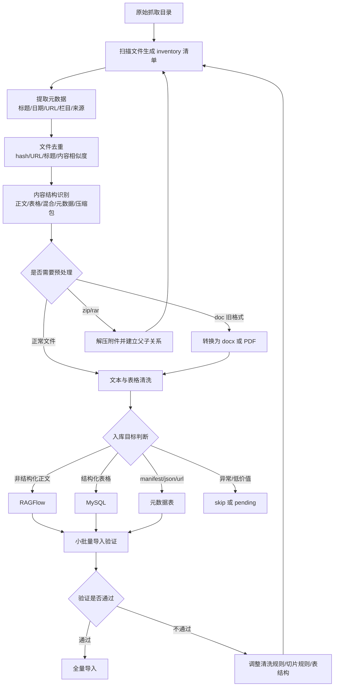

这条流水线的重点是：**先形成可审计的清洗清单，再入库**。不要把原始目录直接上传到 RAGFlow。清洗清单是后续排错、追溯、重跑、增量更新的核心依据。

### 4.1 阶段一：文件扫描

扫描阶段只做“发现”，不做复杂清洗。

输出：

```text
medical_device_kb_inventory.csv
```

主要记录：

```text
文件路径
文件名
扩展名
文件大小
一级目录
初步分类
初步入库目标
```

这个阶段要解决的问题：

1. 总共有多少文件。
2. 每种文件类型多少个。
3. 哪些目录文件最多。
4. 哪些文件明显不适合入库。
5. 哪些文件需要后续转换或解压。

### 4.2 阶段二：元数据抽取

元数据抽取的目标是让每个文件都有可追溯身份。

优先级：

```text
manifest.json > content.txt 头部 > 文件名 > 目录名
```

从 `content.txt` 中识别：

```text
标题:
日期:
URL:
```

从 `manifest.json` 中识别：

```text
title
url
publish_date
attachments
source
crawl_time
```

输出字段：

```text
title
source_url
source_site
source_category
publish_date
crawl_time
attachments_json
```

如果 URL 缺失，应标记：

```text
clean_status = missing_url
```

而不是直接丢弃，因为部分附件可能只有父页面 URL。

### 4.3 阶段三：去重

去重建议分三层：

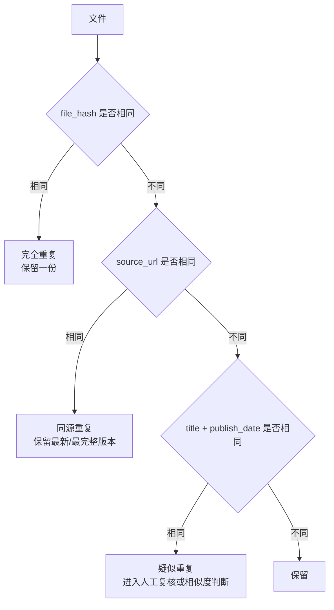

去重策略：

| 重复类型 | 判断方式 | 处理方式 |
| --- | --- | --- |
| 完全重复 | 文件 hash 相同 | 只保留一份 |
| 同源重复 | URL 相同 | 保留内容更完整的一份 |
| 标题重复 | 标题 + 日期相同 | 标记 duplicate_group |
| 附件重复 | 附件名 + 父 URL 相同 | 建立附件关系，不重复入库 |

清洗清单中应保留：

```text
duplicate_group
is_duplicate
duplicate_reason
canonical_file_path
```

### 4.4 阶段四：内容结构识别

内容结构识别决定文件进入 RAGFlow、MySQL，还是两者都进。

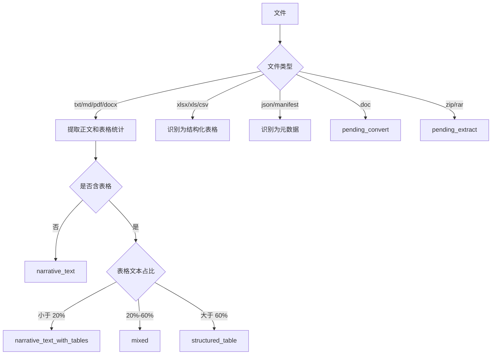

建议判断字段：

```text
paragraph_text_length
table_count
table_text_length
table_text_ratio
max_table_cols
total_table_rows
```

### 4.5 阶段五：入库目标判断

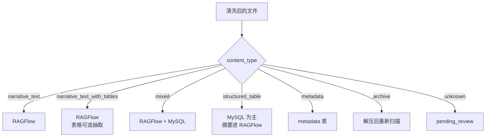

入库目标不是二选一。医疗器械注册资料经常是正文和表格混合，推荐：

```text
原文进 RAGFlow
表格进 MySQL
元数据进 documents
```

## 5. 清洗清单字段设计

建议在现有 `medical_device_kb_inventory.csv` 基础上，生成清洗后的：

```text
medical_device_kb_cleaned_inventory.csv
```

建议字段如下：

| 字段 | 说明 |
| --- | --- |
| `file_path` | 原始文件路径 |
| `file_name` | 文件名 |
| `file_ext` | 扩展名 |
| `file_size` | 文件大小 |
| `file_hash` | 文件 hash |
| `title` | 文档标题 |
| `source_url` | 原始网页 URL |
| `source_site` | 来源网站，如 CMDE/NMPA |
| `source_category` | 来源栏目 |
| `publish_date` | 发布日期 |
| `crawl_time` | 抓取时间 |
| `content_type` | 内容类型 |
| `has_table` | 是否包含表格 |
| `table_count` | 表格数量 |
| `table_row_count` | 表格总行数 |
| `table_col_count` | 最大列数 |
| `text_length` | 文本长度 |
| `table_text_ratio` | 表格文本占比 |
| `import_target` | 入库目标 |
| `ragflow_dataset_name` | RAGFlow dataset |
| `mysql_table_name` | MySQL 表 |
| `duplicate_group` | 重复分组 |
| `is_duplicate` | 是否重复 |
| `clean_status` | 清洗状态 |
| `clean_reason` | 清洗说明 |

`content_type` 建议取值：

```text
narrative_text
structured_table
mixed
metadata
archive
unknown
```

`import_target` 建议取值：

```text
ragflow
mysql
metadata
ragflow+mysql
skip
pending_convert
pending_extract
pending_review
```

## 6. 各类数据处理策略

### 6.1 指导原则文本库

处理方式：

```text
原文 -> RAGFlow
表格 -> MySQL，可选
元数据 -> documents 表
```

预处理重点：

1. 提取标题、发布日期、URL。
2. 保留章节标题。
3. 去除重复附件。
4. 如果文档中有表格，识别是否需要结构化抽取。

目标知识库：

```text
mdr_public_guidelines
```

适合回答：

```text
某类产品注册申报资料要求是什么？
某指导原则有哪些关键技术要求？
```

### 6.2 审评报告

处理方式：

```text
原文 -> RAGFlow
关键字段 -> MySQL
元数据 -> documents 表
```

建议抽取字段：

```text
产品名称
注册申请人
适用范围
主要技术指标
临床评价依据
审评关注点
审评结论
发布日期
URL
```

目标知识库：

```text
mdr_public_review_reports
```

适合回答：

```text
类似产品审评中通常关注哪些风险？
某类产品的审评关注点有哪些？
```

### 6.3 共性问题 / 交流园地

处理方式：

```text
content.txt -> RAGFlow
manifest.json -> 元数据表
附件 -> 按类型重新处理
```

预处理重点：

1. 从 `content.txt` 头部抽取标题、日期、URL。
2. 从 `manifest.json` 补充附件、来源和抓取信息。
3. 清理网页分隔符、导航、重复声明。
4. 使用标题作为 RAGFlow display_name，不要只用 `content.txt`。

目标知识库：

```text
mdr_public_common_questions
```

适合回答：

```text
注册申报中常见补正问题有哪些？
某个审评技术问题中心如何解释？
```

### 6.4 临床评价路径推荐

处理方式：

```text
原文 -> RAGFlow
路径推荐表 -> MySQL
元数据 -> documents 表
```

建议建立专门表：

```sql
clinical_evaluation_paths
- id
- catalog_code
- sub_catalog
- product_category
- product_name_example
- intended_use
- recommended_path
- note
- source_document_id
- source_url
- publish_date
```

目标知识库：

```text
mdr_public_clinical_eval
```

适合回答：

```text
某类产品是否需要临床试验？
某子目录产品推荐哪种临床评价路径？
```

### 6.5 征求意见稿

处理方式：

```text
原文 -> RAGFlow
元数据 -> documents 表
```

必须增加状态字段：

```text
document_status = draft
```

回答时必须提示：

```text
该文件为征求意见稿，不应直接作为现行强制依据。
```

目标知识库：

```text
mdr_public_draft_comments
```

### 6.6 医疗器械批准注册产品公告 / 药监查询数据

这类数据通常是结构化表格，不建议直接进向量库。

处理方式：

```text
Excel -> MySQL
元数据 -> documents 表
必要摘要 -> RAGFlow
```

建议建立表：

```sql
registered_medical_devices
- id
- registration_no
- product_name
- registrant
- agent
- device_class
- approval_date
- expiry_date
- product_structure
- intended_use
- model_specification
- source_file
- source_url
```

适合回答：

```text
某注册证编号对应什么产品？
某企业有哪些已注册产品？
某类产品近年批准情况如何？
```

### 6.7 批件发布-医疗器械

处理方式：

```text
公告正文 -> RAGFlow
附件表格 -> MySQL
元数据 -> documents 表
```

预处理重点：

1. 区分公告正文和附件。
2. 附件如为表格，需要结构化抽取。
3. 保留公告 URL、公告编号、发布日期。

目标知识库：

```text
mdr_public_regulatory_notices
```

### 6.8 JSON / manifest

处理方式：

```text
manifest.json -> 元数据表
```

建议表：

```sql
crawl_manifests
- id
- document_id
- title
- source_url
- publish_date
- attachments_json
- raw_json
- created_at
```

用途：

1. 保留 URL 溯源。
2. 建立网页与附件关系。
3. 辅助去重。
4. 支持后续重新抓取和更新。

### 6.9 doc 旧格式

处理方式：

```text
.doc -> pending_convert -> docx/pdf -> 重新判断
```

不建议直接导入 RAGFlow 全量处理 `.doc`，原因是旧格式解析稳定性和表格抽取质量较差。

### 6.10 zip / rar

处理方式：

```text
zip/rar -> pending_extract -> 解压 -> 重新扫描文件
```

建议保留父子关系：

```sql
document_attachments
- parent_document_id
- attachment_document_id
- attachment_name
- attachment_type
```

## 7. docx 表格识别策略

由于部分 `.docx` 文件中包含结构化表格，因此不能只按扩展名判断入库目标。

建议使用 `python-docx` 统计：

```text
paragraph_text_length
table_count
table_text_length
table_text_ratio
max_table_cols
total_table_rows
```

判断规则：

| 条件 | content_type | 入库策略 |
| --- | --- | --- |
| `table_count = 0` | `narrative_text` | RAGFlow |
| `table_text_ratio < 0.2` | `narrative_text` | RAGFlow，表格可选抽取 |
| `0.2 <= table_text_ratio <= 0.6` | `mixed` | RAGFlow + MySQL 抽表 |
| `table_text_ratio > 0.6` | `structured_table` | MySQL 为主，摘要进 RAGFlow |

## 8. 建库设计

### 8.1 公共知识库

建议创建以下 RAGFlow dataset：

| Dataset | 用途 |
| --- | --- |
| `mdr_public_guidelines` | 指导原则文本库 |
| `mdr_public_review_reports` | 审评报告 |
| `mdr_public_common_questions` | 共性问题、交流园地 |
| `mdr_public_clinical_eval` | 临床评价路径推荐 |
| `mdr_public_draft_comments` | 征求意见稿 |
| `mdr_public_regulatory_notices` | 公告、批件发布 |

### 8.2 工作区知识库

企业内部共享资料按工作区隔离：

```text
mdr_workspace_{workspace_id}
```

适合存放：

1. 公司内部 SOP。
2. 注册申报模板。
3. 历史补正问题。
4. 内部培训资料。
5. 工作区共享项目资料。

### 8.3 用户私有知识库

用户私有资料独立建库：

```text
mdr_user_{workspace_id}_{user_id}
```

适合存放：

1. 用户个人上传文件。
2. 临时分析资料。
3. 私有项目附件。
4. 不应被其他用户检索的资料。

### 8.4 检索权限组合

用户提问时，后端根据身份组合可检索 dataset：

```text
公共知识库
+ 用户所属工作区知识库
+ 用户私有知识库
```

例如：

```text
alice 可检索：
mdr_public_guidelines
mdr_public_review_reports
mdr_public_common_questions
mdr_public_clinical_eval
mdr_workspace_reg_team
mdr_user_reg_team_alice
```

后端不能让前端随意传入 dataset_id，必须由权限系统计算。

## 9. MySQL 表设计建议

### 9.1 文档元数据表

```sql
documents
- id
- title
- source_category
- source_site
- source_url
- publish_date
- crawl_time
- local_path
- file_name
- file_type
- file_hash
- content_type
- visibility
- workspace_id
- user_id
- ragflow_dataset_id
- ragflow_document_id
- status
- created_at
- updated_at
```

### 9.2 RAGFlow dataset 映射表

```sql
knowledge_datasets
- id
- dataset_name
- dataset_type
- workspace_id
- user_id
- ragflow_dataset_id
- description
- created_at
```

### 9.3 表格清单表

```sql
structured_tables
- id
- document_id
- table_name
- table_index
- page_no
- section_title
- columns_json
- row_count
- extraction_method
- created_at
```

### 9.4 表格行表

```sql
structured_table_rows
- id
- table_id
- row_index
- row_json
- row_hash
- source_page_no
- source_section_title
- created_at
```

### 9.5 注册产品表

```sql
registered_medical_devices
- id
- registration_no
- product_name
- registrant
- agent
- device_class
- approval_date
- expiry_date
- product_structure
- intended_use
- model_specification
- source_file
- source_url
```

### 9.6 临床评价路径表

```sql
clinical_evaluation_paths
- id
- catalog_code
- sub_catalog
- product_category
- product_name_example
- intended_use
- recommended_path
- note
- source_document_id
- source_url
- publish_date
```

### 9.7 引用记录表

```sql
answer_citations
- id
- task_id
- answer_id
- citation_index
- source_type
- document_id
- chunk_id
- table_id
- table_row_id
- source_url
- quote_text
- page_no
- section_title
- similarity_score
- created_at
```

## 10. 回答可溯源设计

每次回答应包含引用来源：

```markdown
医疗器械临床评价路径应结合产品分类目录、预期用途、风险程度和同品种情况判断。[1]

如果文件中标注“临床试验”，通常说明该类产品原则上需要开展临床试验。[2]

## 引用来源

[1] 关于发布《医疗器械分类目录》子目录01、04、07、08、09、10、19、21相关产品临床评价推荐路径的通告，CMDE，2022-07-14  
URL: https://www.cmde.org.cn/...

[2] 《医疗器械分类目录》相关产品临床评价推荐路径（2024年增补）使用说明  
来源：CMDE
```

引用来源至少包含：

```text
标题
来源网站
发布日期
URL
引用片段
相似度
页码/章节/表格行
```

## 11. 入库步骤

### 11.1 生成原始清单

```powershell
cd D:\workspace\agent\medireg-agents

uv run python scripts/import_medical_device_kb.py `
  --source "D:\work\爬取的知识库数据" `
  --inventory app/output/medical_device_kb_inventory.csv
```

### 11.2 生成清洗清单

后续建议新增清洗脚本，输出：

```text
app/output/medical_device_kb_cleaned_inventory.csv
```

该清单应包含：

```text
元数据
去重结果
内容结构
入库目标
RAGFlow dataset
MySQL 表
清洗状态
```

### 11.3 小批量导入 RAGFlow

每类先导入 20-50 个样本：

```powershell
uv run python scripts/import_medical_device_kb.py `
  --source "D:\work\爬取的知识库数据" `
  --execute `
  --limit 300 `
  --per-target-limit 50 `
  --batch-size 5 `
  --parse
```

### 11.4 验证召回质量

使用：

```text
docs/医疗器械注册知识库验证用例.md
```

进行验证。

### 11.5 全量导入 RAGFlow

确认解析稳定后，再导入清洗后标记为：

```text
import_target = ragflow
import_target = ragflow+mysql
```

的文件。

### 11.6 结构化数据导入 MySQL

导入：

```text
Excel 注册产品公告
临床评价路径推荐表
docx/pdf 中抽取出来的表格
```

## 12. 验收标准

### 12.1 数据清洗验收

| 指标 | 标准 |
| --- | --- |
| 元数据完整率 | 标题、URL、发布日期尽量完整 |
| 重复文件识别 | 相同 URL/hash 文件可识别 |
| 入库目标准确 | RAGFlow/MySQL/metadata/skip 分类合理 |
| 异常文件标记 | doc、zip、rar、异常扩展名可标记 |
| 表格识别 | docx/xlsx 表格可识别 |

### 12.2 RAGFlow 建库验收

| 指标 | 标准 |
| --- | --- |
| Dataset 创建 | 6 个公共 dataset 创建成功 |
| 文档上传 | 样本文档上传成功 |
| 解析状态 | 大部分文档达到 DONE |
| Chunk 数 | 每个 dataset 有有效 chunk |
| 检索召回 | 验证 case 能召回相关文档 |

### 12.3 可溯源验收

| 指标 | 标准 |
| --- | --- |
| URL 展示 | 回答引用中展示来源 URL |
| 标题展示 | 引用中展示文档标题 |
| 日期展示 | 引用中展示发布日期 |
| 引用片段 | 能展示原文片段 |
| 表格来源 | 结构化答案能追溯到表格行 |

## 13. 最终建议

建议采用以下建库路线：

1. 先完成数据清洗清单。
2. 再小批量导入 RAGFlow，验证解析和召回。
3. 将 Excel 和 docx 表格抽取到 MySQL。
4. 将 manifest/json 元数据入 documents 和 crawl_manifests。
5. 将公共法规资料、工作区资料、用户私有资料分 dataset 隔离。
6. 回答时必须展示引用来源、URL 和原文片段。

最终形成：

```text
RAGFlow：负责非结构化文档语义检索
MySQL：负责结构化表格和精确查询
documents 元数据表：负责来源、URL、版本和权限
answer_citations：负责回答可追溯
```

这样建库后，系统既能回答开放性法规问题，也能查询结构化注册数据，还能让用户清楚看到每个结论来自哪里。

## 14. 详细实施流程图

本章把前面的方案进一步展开为可执行流程。建议后续开发、外包对接、数据治理和验收都按这些流程推进。

### 14.1 总体数据处理流程

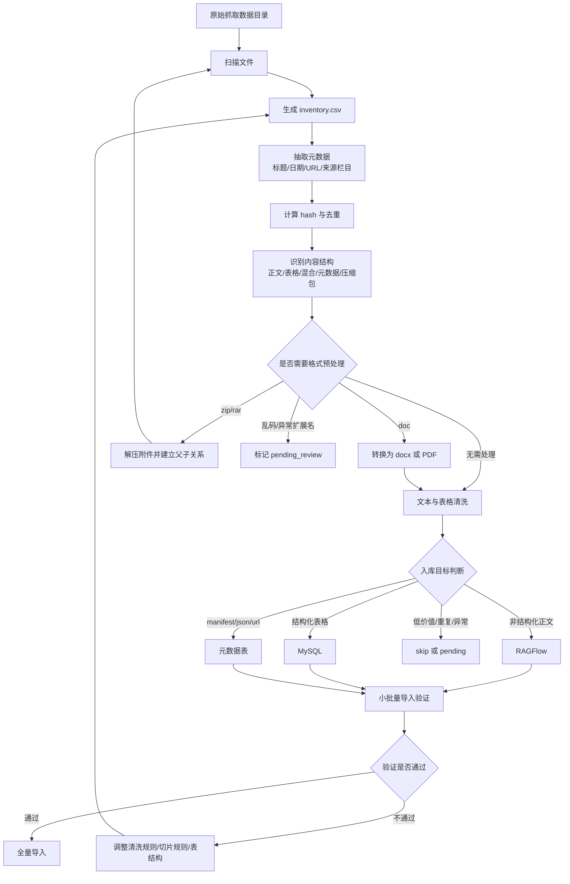

这个流程的核心不是“把文件导进去”，而是建立一套可重复、可追溯、可回滚的数据工程流程。后续如果重新抓取数据，也应重新走同一套流程，而不是手工上传。

### 14.2 数据分流流程

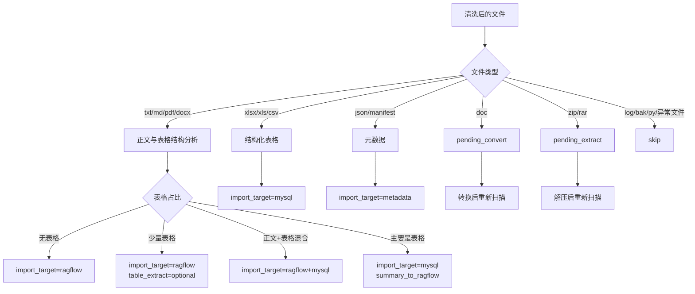

建议不要简单使用扩展名判断。尤其是 `.docx`，有些是正文，有些是表格，有些是正文和表格混合。判断时需要统计表格数量、表格行列数和表格文本占比。

### 14.3 RAGFlow 建库流程

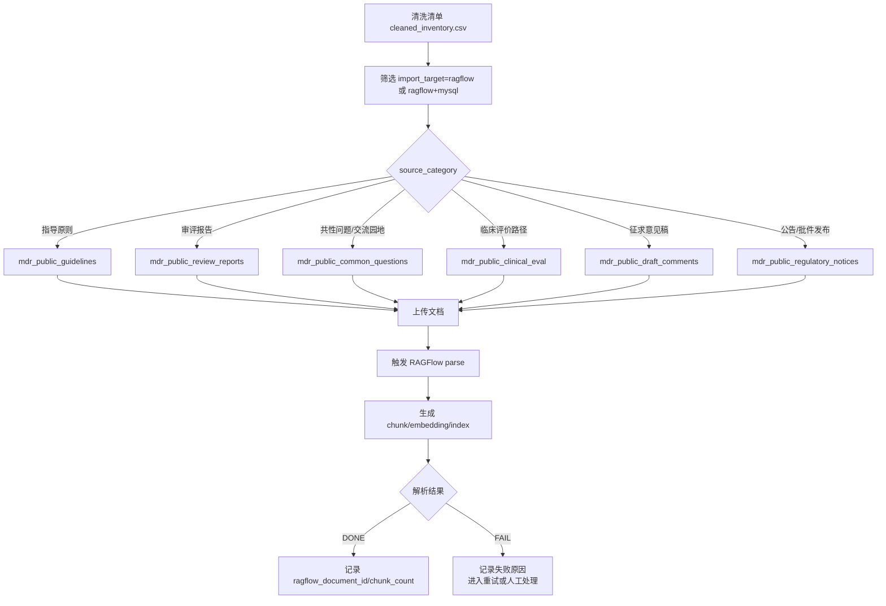

RAGFlow 文档显示名建议使用：

```text
发布日期_标题.扩展名
```

不要使用大量 `content.txt` 作为显示名，否则检索引用时用户无法判断来源。

### 14.4 MySQL 结构化入库流程

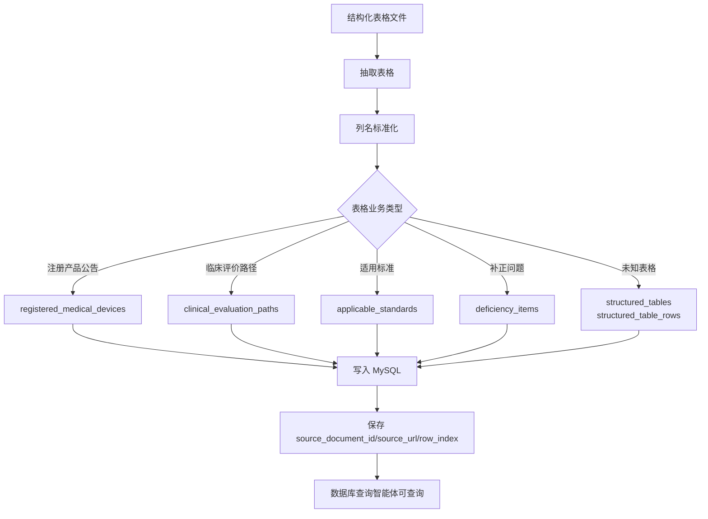

字段标准化示例：

| 原始列名 | 标准字段 |
| --- | --- |
| 注册证编号、注册证号、注册编号 | `registration_no` |
| 产品名称、器械名称 | `product_name` |
| 注册人、注册申请人、企业名称 | `registrant` |
| 批准日期、发证日期 | `approval_date` |
| 有效期至、有效截止日期 | `expiry_date` |
| 结构及组成、结构组成 | `product_structure` |
| 适用范围、预期用途 | `intended_use` |

### 14.5 URL 与元数据处理流程

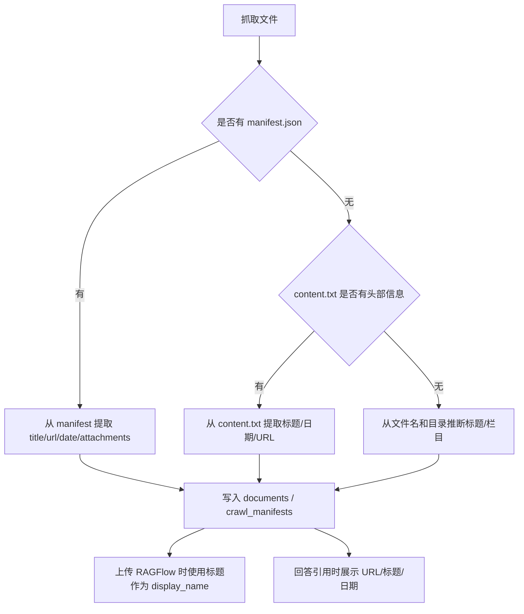

元数据提取优先级：

```text
manifest.json > content.txt 头部 > 文件名 > 目录名
```

URL 不应只作为正文的一部分进入 RAGFlow，而应写入 `documents.source_url` 和 `answer_citations.source_url`。

### 14.6 用户私有数据隔离流程

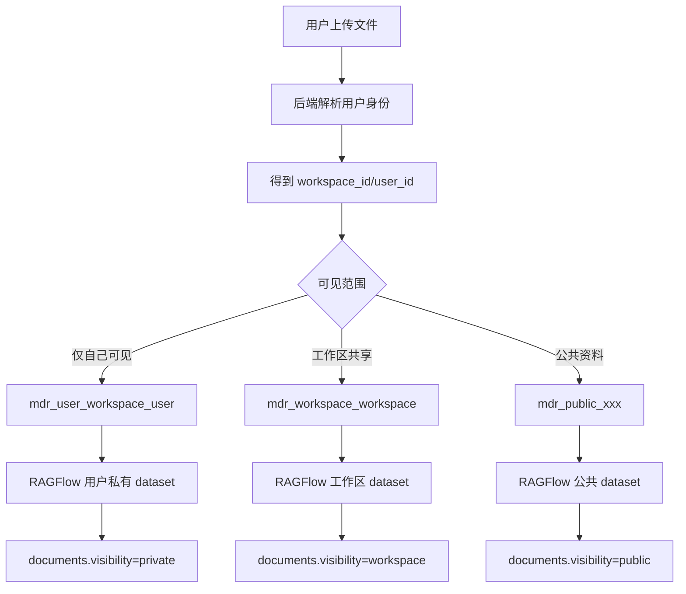

用户提问时，后端按权限组合可检索范围：

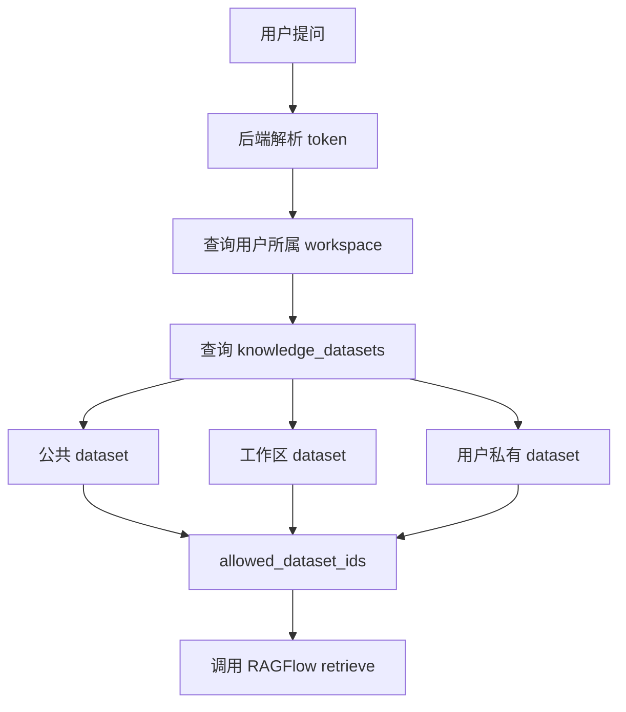

关键要求：

1. 前端不能直接指定任意 dataset_id。
2. 后端必须根据用户身份计算 allowed_dataset_ids。
3. 用户私有文件不能进入公共 dataset。
4. 工作区资料不能被其他工作区用户检索。

### 14.7 回答可溯源流程

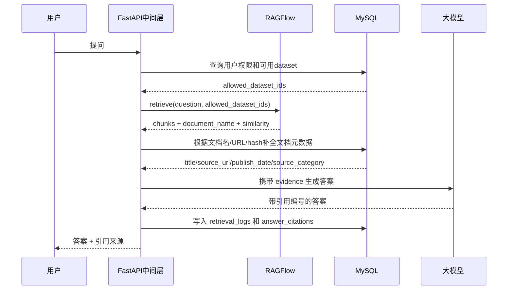

Evidence 结构建议：

```json
{
  "citation_id": 1,
  "source_type": "ragflow_chunk",
  "title": "关于发布《医疗器械分类目录》相关产品临床评价推荐路径的通告",
  "source_url": "https://www.cmde.org.cn/...",
  "publish_date": "2022-07-14",
  "dataset_name": "mdr_public_clinical_eval",
  "document_name": "2022-07-14_临床评价推荐路径通告.txt",
  "similarity": 0.678,
  "quote_text": "为进一步指导注册申请人确定具体产品的临床评价路径..."
}
```

回答格式建议：

```markdown
医疗器械临床评价路径应结合产品分类目录、预期用途、风险程度和同品种情况判断。[1]

如果文件中标注“临床试验”，通常说明该类产品原则上需要开展临床试验。[2]

## 引用来源

[1] 关于发布《医疗器械分类目录》相关产品临床评价推荐路径的通告，CMDE，2022-07-14  
URL: https://www.cmde.org.cn/...

[2] 《医疗器械分类目录》相关产品临床评价推荐路径（2024年增补）使用说明  
来源：CMDE
```

### 14.8 增量更新流程

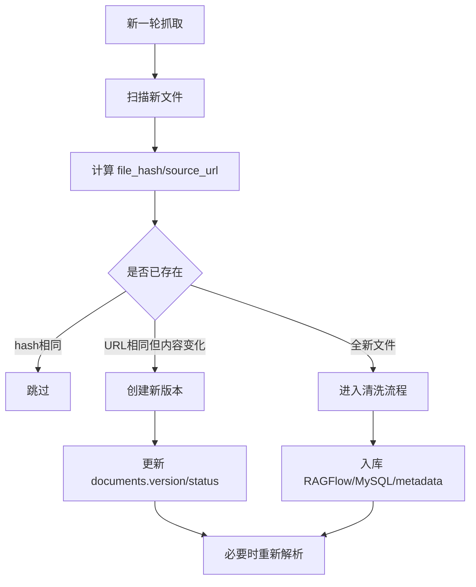

增量更新时不要覆盖旧记录，应保留版本：

```text
source_url 相同 + hash 不同 = 新版本
source_url 相同 + hash 相同 = 重复
source_url 不同 + 标题相似 = 疑似重复，进入复核
```

### 14.9 推荐落地顺序

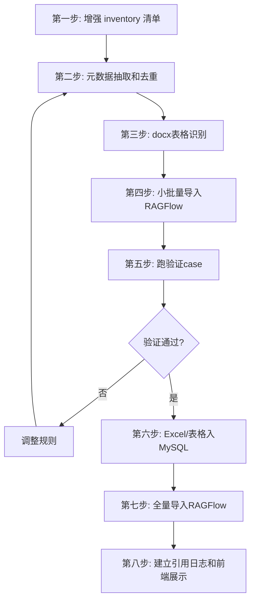

建议不要一次性做全量。先按每个 dataset 20-50 篇样本跑通，再扩大到 300-500 篇，最后全量。
